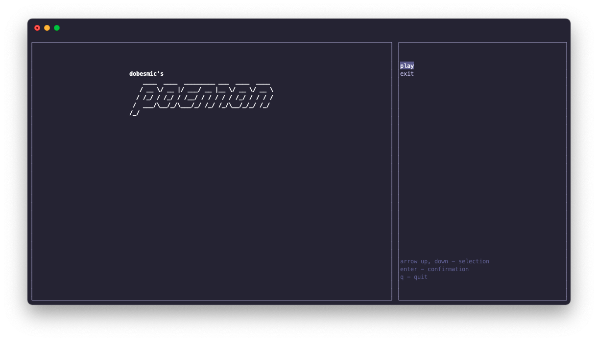
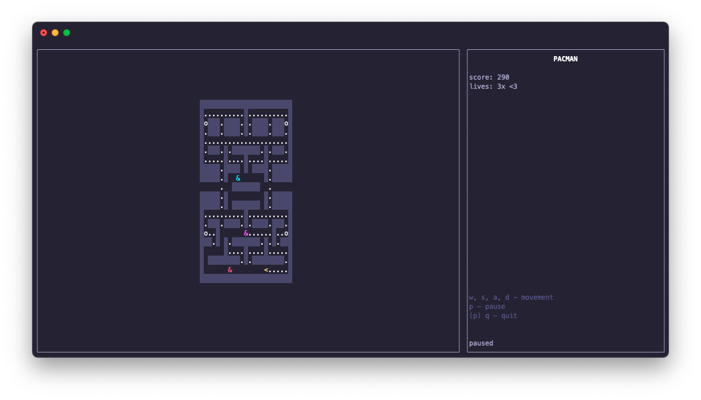

# Pacman (BI-PA2)

A Pacman game clone fully playable in terminal.

The game was written in C++ and uses ncurses library for drawing content to the terminal.

This project was created as a semestral work for my 'Programming and algorithmization 2' course at FIT CTU.

The game has 4 kinds of enemies (ghosts), each with its own artificial intelligence, implemented in the same way as in the original game.
Furthermore, the game board is implemented along with cells like wall, space, coins, 
bonus and power-up. The game board supports teleportation from one edge to the other.
The ghosts cycle between chase, scatter and frighten mode, which is activated by the player collecting a power-up.

Once started, the game offers a choice of difficulty, as well as loading the game configuration from a file and
loading the map from a file. The game then starts. When the game is finished, either by picking up
all coins or by losing all lives, the highest score is saved back into the 
configuration file.

The game rendering is implemented using the ncurses library. The game uses an internal architecture based on simplified Model-View-ViewModel system.

#### Compilation and manual

The source code is in the *src* subdirectory.

The game can compiled from the project root directory using `make compile`, which creates object files and compiles the binary of the game as *dobesmic* binary.

Documentation of the code and polymorphism is generated using Doxygen. The [main documentation page](semestral/doc/pages/mainpage.md) also contains details about the format of the configuration files for the game, the map file for the game, and the controls. The documentation can be generated from the project root directory using `make doc`, and then is to be found as html at *doc/index.html*. 

All generated files can be removed from the directory using `make clean`, which will restore the directory to its original state.

##### Evaluation

The final evaluation of my semestral work is 12/12 (100%) points.
