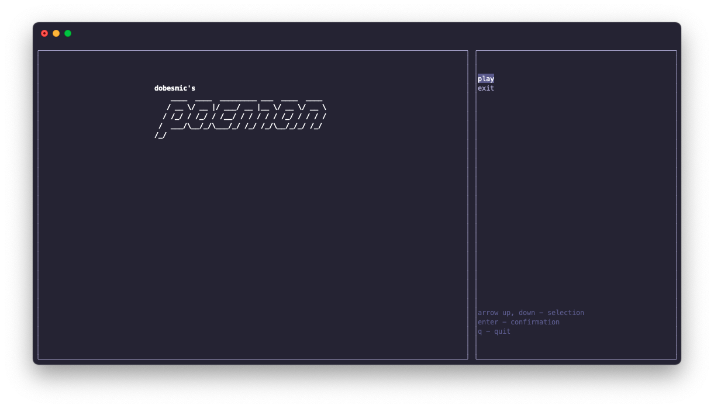
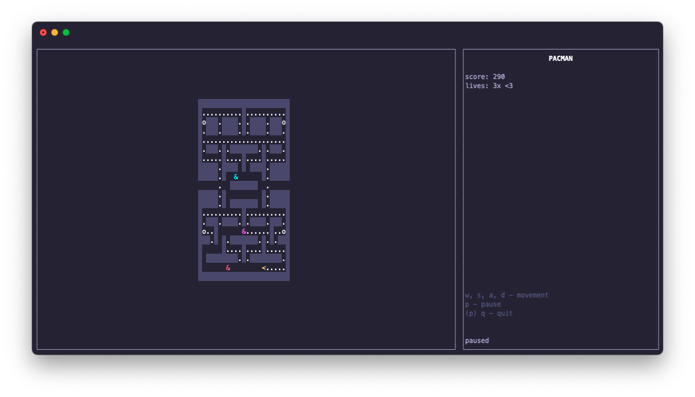
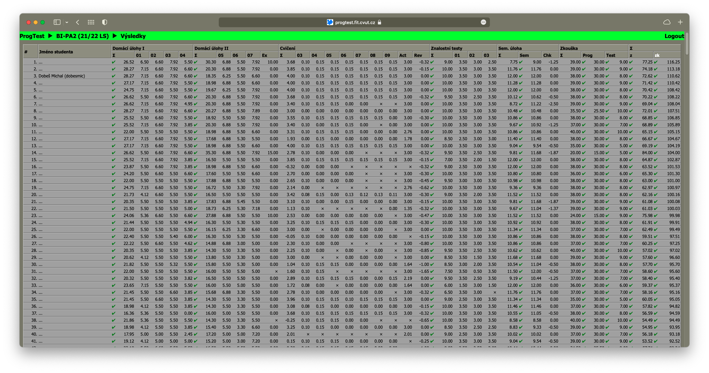

# BI-PA2

This repository was created as a part of my 'Programming and algorithmization 2' course at FIT CTU.

The main focus of this course is object-oriented programming in C++, the repository contains all the code I wrote for this course during the semester

## Structure

The repository is structured as a monorepo, containing all individual tasks and semestral work. Homeworks are stored in *tasks*, semestral work is stored in *semestral*.

### Semestral work

The task of my semestral work was to create a classic PacMan game.

The game has 4 kinds of enemies (ghosts), each with its own artificial intelligence, implemented in the same way as the original game.
Furthermore, the game board is implemented along with cells like wall, space, coins, 
bonus and power-up. The game board supports teleportation from one edge to the other.
The ghosts cycle between chase, scatter and frighten mode, which is activated by the player collecting a power-up.

Once started, the game offers a choice of difficulty, as well as loading the game configuration from a file and
loading the map from a file. The game then starts. When the game is finished, either by picking up
all coins or by losing all lives, the highest score is saved back into the 
configuration file.

The game rendering is implemented using the ncurses library. The program will use an internal architecture based on the Model-View-ViewModel system.

#### Compilation and manual

All parts of the semestral work are in the *semestral* directory. The source codes are in the *semestral/src* subdirectory.

The game can compiled from the *semestral* directory using `make compile`, which creates object files and compiles the binary of the game as *semestral/dobesmic*.

Documentation of the code and polymorphism is generated using Doxygen. The [main documentation page](semestral/doc/pages/mainpage.md) also contains details about the format of the configuration files for the game, the map file for the game, and the controls. The documentation can be generated from the *semestral* directory using `make doc`, and then is to be found as html at *semestral/doc/index.html*. 

All generated files can be removed from the *semestral* directory using `make clean`, which will restore the directory to its original state.

#### Evaluation

The final evaluation of my semestral work is 12/12 (100%) points.

### Tasks

Homeworks are big tasks, exercises are mini practice tasks.

Each task contains source code and asserts that show the correct functionality of the code.

#### Points earned

##### Homeworks
| hw | points/max |
| --- | --- |
| hw01 | 7.15/5 |
| hw02 | 6.60/5 |
| hw03 | 7.92/5 |
| hw04 | 6.6/5 |
| hw05 | 6.25/5 |
| hw06 | 5.50/5 |
| hw07 | 6.60/5 |

##### Exercises
| ex | points |
| --- | --- |
| ex03 | 0.1/0.1 |
| ex04 | 0.15/0.15 |
| ex05 | 0.15/0.15 |
| ex06 | 0.15/0.15 |
| ex07 | 0.15/0.15 |
| ex08 | 0.15/0.15 |
| ex09 | 0.15/0.15 |

Note: Maximum points are quoted without bonuses for early submission/efficiency of solution

## Final results

3rd best in semester, out of total 612 students. 

